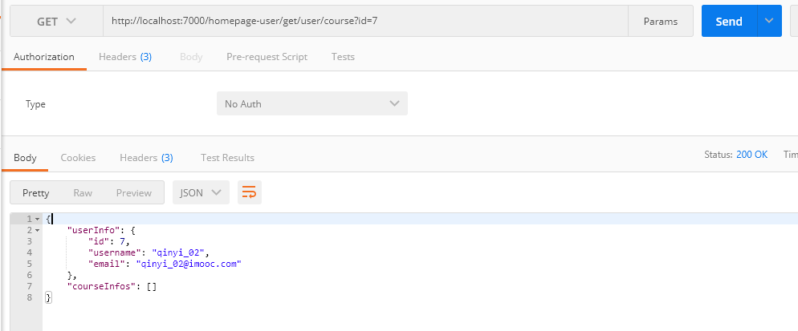

title: SpringCloud—服务熔断利器Hystrix
author: Loux

cover: /img/post/33.jpg

tags:

  - spring cloud
categories:
  - 微服务
date: 2020-02-12 20:50:00

---

我们知道在Spring cloud微服务架构中，系统被细分为很多个子服务，部署在不同的服务器上。服务之间的通信依靠http请求完成。在正常的情况下这样的思路是没有问题的，可是一旦某服务A所在的服务器宕机，并且该服务没有其它的服务器实例的时候，服务B调用服务A的请求就会超时，导致服务B不可用..........这样依次进行下去，就会导致许多个服务模块都不可用，引起**服务雪崩效应**。

  

虽然我们可以部署服务的多个实例，当一台或两台该服务的实例挂掉之后，还能有服务器能提供服务，这样可以大大减小服务不可用的几率。但是万一就那么倒霉，全部挂掉了怎么办？我们肯定是要有防备措施的。比如当服务不可用时调用方直接返回失败，或者给定一些默认的值当服务不可用时使用默认值，这样总比直接给用户返回一个错误页面要友好的多。而Hystrix就是帮我们做这些事的，可以说是维持系统高可用的一个保障了。

# Hystrix介绍

Hystrix是一个熔断器，就类似于我们生活中的保险丝一样，只是功能更加的高级。Hystrix有一个断路器机制，若在一段时间内检测到服务调用失败的次数比例超过了一定的阈值（默认百分之50），Hystrix会进入到开路状态，这时所有发往该服务的请求会直接返回失败。并且在过一段时间后（默认5s），断路器会切换到半开路状态，此时会判断下一次请求是否成功，若成功则断路器进入闭路状态，服务就能正常访问了，若不成功则又会重新切换到开路状态。是不是感觉非常的智能呢？

## 服务的降级

Hystrix还支持服务的降级。我们可以定义一些默认的fallback()方法，当服务调用异常时，就会执行fallback()方法，这就是服务的降级。举个例子：现在我们用户服务要调用课程服务查询当前用户订阅的课程列表，此时课程服务全部挂掉了，当Hystrix检测到课程服务异常后，用户服务作为服务调用方就会执行我们编写好的fallback()方法，从Redis中获取到该用户的课程列表。这样下来，虽然获取到的列表不是最新的，但是避免了服务不可用导致的错误或空白列表，对用户的体验更好。

## 资源的隔离

在Hystrix中，主要通过线程池进行资源的隔离。在使用的过程中，会根据我们调用不同的微服务，来生成足够数量的线程池，我们知道不同的线程池之间是完全隔离的，这样即使一个服务的调用出现了问题，不会影响其它服务的调用，提升了调用方的可用性。但是这也不是没有缺点的，维护多个线程池会对整个系统带来额外的性能开销。若对性能有严格要求的，可以采用Hystrix的信号量模式实现资源的隔离。

# 在Feign中使用Hystrix

由于Hystrix是用来解决微服务调用过程中的问题的，而Feign就是微服务调用的客户端。所以Spring Cloud贴心的将它们整合了起来，在Feign中我们可以使用Hystrix服务降级的功能。

就以上篇文章的两个服务为例。现在我们要使用服务降级的功能，应该在服务的调用方用户服务中进行以下设置：

1.在课程服务的配置文件中加入以下配置

```yml
feign:
  hystrix:
    enabled: true   #设置hystrix为true，即在Feign中可以使用熔断器
```

2.写一个类实现上篇文章我们编写的CourseClient

```java
/**
 * 调用课程微服务失败后进行熔断降级的策略
 */
@Component
public class CourseClientHystrix  implements CourseClient{

    @Override
    public String getPort() {
        return "10086";
    }

    /**
     * 调用失败后返回无效的课程信息
     * @param id
     * @return
     */
    @Override
    public CourseInfo getCourseInfo(Long id) {
        return CourseInfo.invalid();
    }

    /**
     * 调用失败后返回空的课程列表
     * @param request
     * @return
     */
    @Override
    public List<CourseInfo> getCourseInfos(CourseInfosRequest request) {
        return Collections.emptyList();
    }
}
```

这里的方法，就是当课程服务不可用时，保守执行的方法。

3.在CourseClient中@FeignClient注解中加入fallback属性，如下

`@FeignClient(value = "eureka-client-homepage-course",fallback = CourseClientHystrix.class) `

这里fallback的内容就是刚刚编写的服务降级策略类。

进行测试，当课程服务和用户服务都正常启动的时候，访问用户服务中获取课程列表的api，返回结果如下：


现在我们关闭课程服务，等待Eureka将其移除后，再访问该api，结果如下：



我们可以看到，接口还是能正常访问的，只是课程列表返回的为空列表而已。在实际项目中，我们一般不会选择返回空列表，而是会返回缓存的一些数据。

# 使用Spring Cloud Hystrix

虽然在Feign中我们可以使用Feign封装的Hystrix实现服务降级。但是若我们想要使用Hystrix更多的功能，还是需要单独引入Hystrix的依赖。

由于我们用户服务调用课程服务的api，所以在用户服务中引入Hystrix的依赖：

```xml
  <dependency>
      <groupId>org.springframework.cloud</groupId>
      <artifactId>spring-cloud-starter-netflix-hystrix</artifactId>
  </dependency>
```

我们把@FeignClient中的fallback属性祛除掉，接下来编写Hystrix自带方式实现服务的降级

```java
  @HystrixCommand(fallbackMethod = "fallbackMethod")   //使用Hystrix自带方式服务降级
    @GetMapping("/get/coursePort")
    public String getCoursePort(){
        return courseClient.getPort();
    }

  public String fallbackMethod(){
        return "10010";
    }
```

可以看到，我们在获取课程服务的端口上加上了`@HystrixCommand(fallbackMethod = "fallbackMethod")`，

注意这里的fallbackMLethod方法必须与@HystrixCommand注解定义在同一个类中。

进入@HystrixCommand注解中，其源码如下：

```java
@Target({ElementType.METHOD})
@Retention(RetentionPolicy.RUNTIME)
@Inherited
@Documented
public @interface HystrixCommand {
    String groupKey() default "";

    String commandKey() default "";

    String threadPoolKey() default "";

    String fallbackMethod() default "";

    HystrixProperty[] commandProperties() default {};

    HystrixProperty[] threadPoolProperties() default {};

    Class<? extends Throwable>[] ignoreExceptions() default {};

    ObservableExecutionMode observableExecutionMode() default ObservableExecutionMode.EAGER;

    HystrixException[] raiseHystrixExceptions() default {};

    String defaultFallback() default "";
}

```

发现它还有一些其它的属性，在这之中，一些常用的属性配置含义如下

* **CommandKey**—给这个Command一个全局唯一标识，默认是@HystrixCommand所在方法的方法名
* **groupKey**— 配置全局唯一标识服务分组的名称 ，一般同一个服务的调用使用同一个分组。例如在用户服务中定义了很多访问课程服务的接口，也就是说有很多@HystrixCommand注解，那么最好将这些注解中的groupKey设置为相同。因为 Hystrix会让相同groupKey值的操作使用同一个线程池 
* **threadPoolKey**— 对线程池进行设定，细粒度的配置，相当于对单个服务的线程池信息进行设置，也可多个服务设置同一个threadPoolKey构成线程组
*  **commandProperties**—配置@HystrixCommand的属性，比如采用信号量隔离还是线程隔离。默认采用线程隔离。
*  **threadPoolProperties** —对线程池进行配置，比如核心线程数，最大线程数等，对线程池中参数含义不了解的，可以看我的另外一篇文章 <a href=" [https://www.lxfun.cn/2020/01/13/Java%E7%BA%BF%E7%A8%8B%E6%B1%A0%E7%9A%84%E5%8E%9F%E7%90%86%E4%B8%8E%E4%BD%BF%E7%94%A8%E2%80%94%E9%9D%A2%E8%AF%95%E5%BF%85%E5%A4%87/](https://www.lxfun.cn/2020/01/13/Java线程池的原理与使用—面试必备/) ">Java线程池的原理与使用—面试必备</a>
*  **ignoreExceptions** —Hystrix中默认除了HystrixBadRequestException外，其它异常均会被Hystrix判定为执行失败，而执行fallbackMethod，若我们想要哪些异常被允许，不执行fallbackMethod，在此属性中定义

接下来我们只启动用户服务，不启动课程服务，访问获取课程服务接口的api，看是什么效果


可以看到，因为调用不了课程服务的接口，而执行了兜底方法fallbackMethod

> 值得注意的是，当请求失败、请求被拒绝、超时、断路器被打开，都会进入兜底的方法。但是进入回退方法并不代表断路器被打开了。断路器打开需要一定时间内失败的次数达到一个阈值

我们来做一个测试验证其情况，首先我们引入springboot—actuator的依赖

```xml
<dependency>
   <groupId>org.springframework.boot</groupId>
   <artifactId>spring-boot-starter-actuator</artifactId>
</dependency>
```

接下来在配置文件中开启一个配置，使得actuator能监控系统的详细信息，不然的话看不了Hystrix断路器的情况

```yml
management:
  endpoint:
    health:
      show-details: always    #监控系统详细信
```

现在我们执行一次获取课程服务端口的api，返回了“10010”，说明执行了兜底方法。此时我们来看一下acatuator的状态：


我们看到，最下方Hystrix的status为UP，说明此时断路器还未打开。

接下来我们再狂点postMan中send请求几十次（发挥出单身的手速），再来看acatuator的监控情况


此时我们发现断路器才被打开，并且可以看到是由于访问课程服务getPort()方法失败造成的